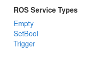

# [Service]()

## Learn by doing
### Basic
- [ ] Write service node with each standard srv types and try invoking them with
```
rosservice call <service_name> std_srv/Empty
rosservice call <service_name> std_srv/SetBool true
ros
```


- [ ] Subscribe to array of integer and print it.

### Advanced

## Ask yourself
