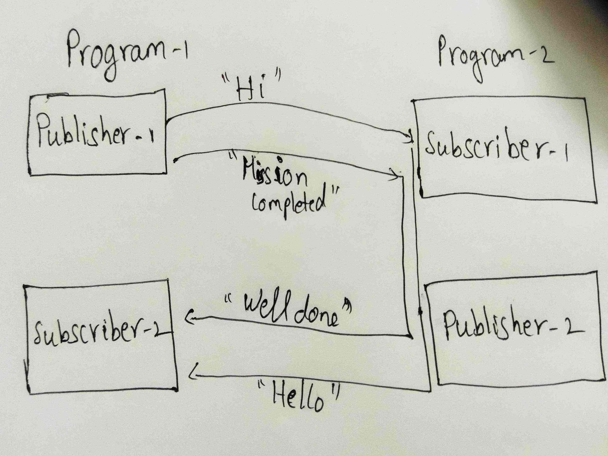

# [Subscriber](http://wiki.ros.org/ROS/Tutorials/WritingPublisherSubscriber%28c%2B%2B%29)

## Learn by doing
### Basic
- [ ] Subscribe to "hello world" publisher and print it.[Pair](./publisher.md#L5) - *helloworld_subscriber.[cpp|py]*
- [ ] Subscribe to array of integer and print it.  - *array_subscriber.[cpp|py]*

### Advanced
- [ ] Write two programs with below architecture, whenever first program publishes **"Hi"**, second program should publish **"hello"** and similarly for **"Mission completed"** ,**"Well done"** - *pub_and_sub_pg1.[cpp|py]*, *pub_and_sub_pg2.[cpp|py]*
<br/>


- [ ] Write two programs with below architecture, one program contains two publishers - *two_pub.[cpp|py]*
```cpp
// Pseudo code
// Publish in the below code format
for(...)
{
    // Publishes numbers from 0 to n
    Publisher1(<integer>)

    // Publishes alphabat
    Publisher2(<alphabat>)
}
```
Another program, contains two subscriber - *two_sub.[cpp|py]* 
```cpp
subscriber_callback1(...)
{
    // Print the data from topic

    // Sleep for 10 seconds
    ros::Duration(10).sleep()
}

subscriber_callback2()
{
    // Print the data from topic
}
```

## Ask yourself
- [ ] Is there any better way to communicate instead of the [first program in advanced](#L9) ?
